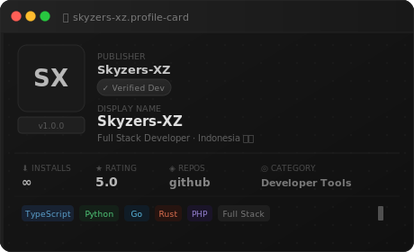

<!--
╔══════════════════════════════════════════════════════════════════════════════╗
║                        GitHub Profile — Skyzers-XZ                          ║
║                        README.md  |  Made with ❤️                            ║
╚══════════════════════════════════════════════════════════════════════════════╝
-->

<!-- TYPING ANIMATION HEADER -->
<div align="center">

[](https://git.io/typing-svg)

</div>

<!-- MAIN BANNER -->
<div align="center">
  
</div>

<br/>

---

<!-- SNAPCODE CARD -->
<div align="center">
  
</div>

<br/>

---

<!-- ABOUT ME -->
## 👾 About Me

```typescript
const skyzers = {
  name        : "Skyzers-XZ",
  role        : "Full Stack Developer",
  location    : "Indonesia 🇮🇩",
  available   : true,
  focus       : [
    "Web Development",
    "API Design & Architecture",
    "Performance Optimization",
    "Developer Tooling",
  ],
  currently   : "Building something awesome ✨",
  motto       : "Make it work → Make it right → Make it fast",
};
```

<br/>

---

<!-- TECH STACK -->
## 🛠️ Tech Stack

<div align="center">

### 🔤 Programming Languages


### 🌐 Frontend


### ⚙️ Backend


### 🗄️ Database & Infrastructure


</div>

<br/>

---

<!-- GITHUB STATS — streak only -->
## 📊 GitHub Statistics

<div align="center">
  
</div>

<br/>

---

<!-- SNAKE ANIMATION -->
## 🐍 Contribution Snake

<div align="center">

> 🕹️ The snake eats my GitHub contributions every day!

<picture>
  <source media="(prefers-color-scheme: dark)"
          srcset="https://raw.githubusercontent.com/Skyzers-XZ/Skyzers-XZ/output/snake-dark.svg" />
  <source media="(prefers-color-scheme: light)"
          srcset="https://raw.githubusercontent.com/Skyzers-XZ/Skyzers-XZ/output/snake.svg" />
  
</picture>

</div>

<br/>

---

<!-- ACTIVITY GRAPH -->
## 📈 Activity Graph

<div align="center">
  
</div>

<br/>

---

<!-- SOCIAL LINKS -->
<div align="center">

## 🔗 Find Me

[](https://twitter.com/Skyzers_XZ)
[](https://instagram.com/skyzers_xz)
[](https://discord.com/users/Skyzers)
[](https://t.me/Skyzers)
[](https://github.com/Skyzers-XZ)

</div>

<br/>

---

<!-- PROFILE VIEWS COUNTER -->
<div align="center">


</div>

<!-- QUOTE BLOCK -->
<div align="center">

```
╔════════════════════════════════════════════╗
║   "Clean code is not written by following  ║
║    a set of rules. You know you are         ║
║    working on clean code when each routine  ║
║    you read turns out to be pretty much     ║
║    what you expected."                      ║
║                                             ║
║                     — Robert C. Martin      ║
╚════════════════════════════════════════════╝
```

*Auto-updated · Made with ❤️ by Skyzers-XZ*

</div>

<!-- WAVE FOOTER -->

